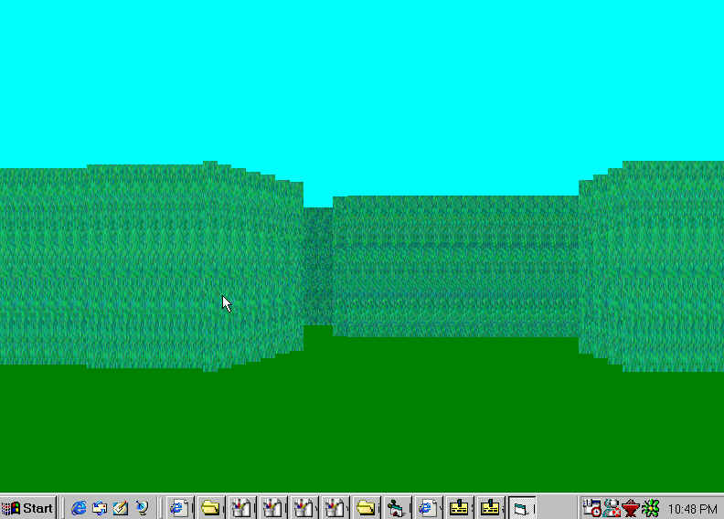



## a 3D hedge maze game

### Description

3D hedge game This uses paint picture to make texture on the walls, they also have lighting effects. It uses the dim statement to make its walls.

Its has exelent graphics and renders very smoothly, and goes very quick

If you like this game pls vote for it.
 
### More Info
 
arrow keys

3D hedge game This uses paint picture to make texture on the walls, they also have lighting effects. It uses the dim statement to make its walls.

If you like this game pls vote for it.

             |
---                |---
**Submitted On**   |2001-02-03 16:24:36
**By**             |[chris mulley](https://github.com/Planet-Source-Code/PSCIndex/blob/master/ByAuthor/chris-mulley.md)
**Level**          |Intermediate
**User Rating**    |4.4 (62 globes from 14 users)
**Compatibility**  |VB 6\.0
**Category**       |[Games](https://github.com/Planet-Source-Code/PSCIndex/blob/master/ByCategory/games__1-38.md)
**World**          |[Visual Basic](https://github.com/Planet-Source-Code/PSCIndex/blob/master/ByWorld/visual-basic.md)
**Archive File**   |[CODE\_UPLOAD14499232001\.zip](https://github.com/Planet-Source-Code/chris-mulley-a-3d-hedge-maze-game__1-14986/archive/master.zip)

